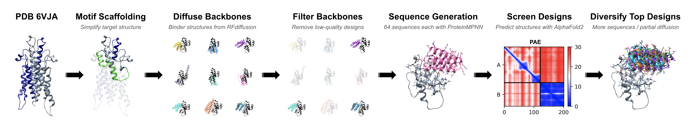

# Team "Tumor Inhibitors"
## BioML Challenge 2024: Bits to Binders

  

## Abstract

text text text...

## Pipeline

  

text text text...

## Files Included

 - **Run_ProteinMPNN_and_AlphaFold2_for_RFdiffusion_Binders_with_ColabDesign_gdrive.ipynb:** Colab notebook for running ProteinMPNN/AlphaFold2 via the ColabDesign framework for RFdiffusion binder backbones.
 - **Filter_RFD_backbones_with_membrane_check.py:** Script for filtering RFdiffusion binder backbones to remove low-quality binder structures, incorrectly located binders, and binder backbones that clash with the cell membrane. Requires a copy of 6y97_default_dppc.mpmd.finalframe.atomistic.pdb from (MemProtMD)[https://memprotmd.bioch.ox.ac.uk/_ref/PDB/6y97/_sim/6y97_default_dppc/] with solvent/ions deleted.

